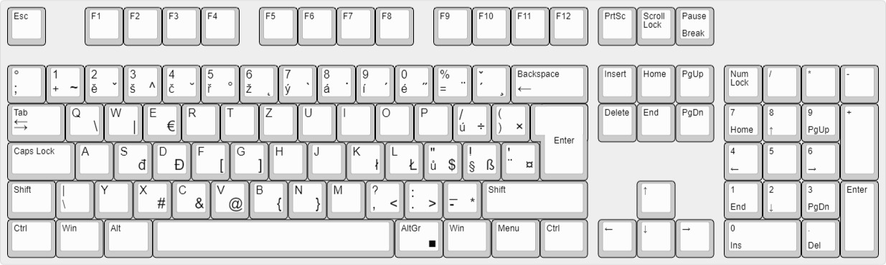

# Keyboard Shortcuts

**`ALT + Number:`**

| Nuber | Symbol |
| :---- | :----: |
| 33    |   !    |
| 35    |   #    |
| 36    |   $    |
| 60    |   <    |
| 62    |   >    |
| 63    |   ?    |
| 91    |   [    |
| 93    |   ]    |
| 92    |   \\   |
| 96    |   `    |
| 123   |   {    |
| 124   |   \|   |
| 125   |   }    |

---

## CES-CZ Layout

